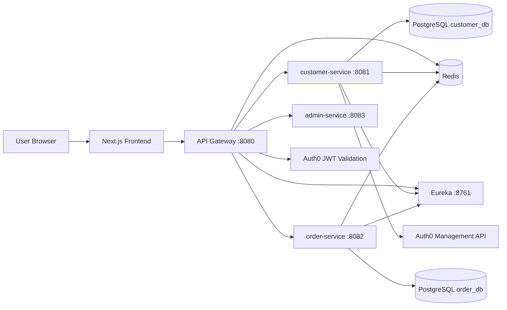
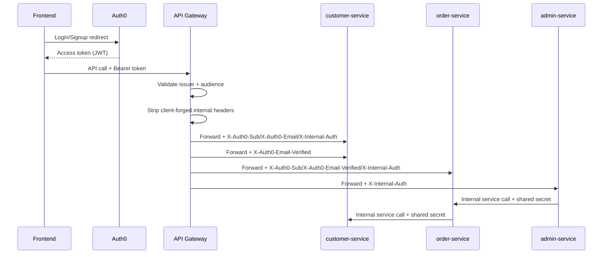

# Spring Boot Microservice Platform

Full-stack microservice system with Auth0-based user identity, Spring Cloud Gateway, Eureka service discovery, Redis caching/rate-limiting, and a Next.js frontend.

## Architecture Overview



## Repository Structure

- `Services/discovery-server`: Eureka server
- `Services/api-gateway`: Spring Cloud Gateway (JWT auth, header relay, rate limiting)
- `Services/customer-service`: customer domain + Auth0 management integration
- `Services/order-service`: order domain + customer-service integration
- `Services/admin-service`: admin APIs (aggregates privileged order views)
- `microservce-frontend`: Next.js UI (Auth0 SPA flow)
- `env/*-sample.env`: environment variable templates
- `docker-compose.yml`: stack without PostgreSQL containers (external DB expected)
- `docker-compose-db.yml`: stack with PostgreSQL containers

## Tech Stack

- Java 21, Spring Boot 4.0.2, Spring Cloud 2025.1.1
- Spring Cloud Gateway (WebFlux), Spring MVC services
- Eureka discovery
- PostgreSQL (customer/order services)
- Redis (gateway rate limit + service caches)
- Resilience4j (order-service -> customer-service calls)
- Next.js 16 + React 19 + Auth0 SPA SDK
- Docker multi-stage images for all services

## Service Responsibilities

### discovery-server
- Hosts service registry (`:8761`)
- Other services register and resolve by logical service ID

### api-gateway
- Public API entrypoint
- Validates Auth0 JWT issuer + audience
- Exposes only user-scoped endpoints:
  - `/customers/register`, `/customers/register-auth0`, `/customers/me`
  - `/orders/me`, `/orders/me/**`
- Enforces `email_verified=true` for:
  - `/customers/register-auth0`, `/customers/me`
  - `/orders/me`, `/orders/me/**`
- Denies raw backend paths (`/customers/**`, `/orders/**`) by default
- Exposes admin endpoint:
  - `/admin/orders` (requires `ROLE_admin` or `read:admin-orders` permission)
- Adds/propagates:
  - `X-Request-Id`
  - `X-Auth0-Sub`
  - `X-Auth0-Email`
  - `X-Internal-Auth` (shared secret for internal trust)
- Applies Redis-backed route-aware rate limits:
  - register
  - customer-me
  - orders-me
  - admin-orders

### customer-service
- Customer CRUD/register logic
- Supports:
  - direct register (`/customers/register`) using Auth0 Management API
  - token-based register (`/customers/register-auth0`) for logged-in user bootstrap
- Caches `customerByAuth0` in Redis
- Verifies internal trust header on `/customers/me` and `/customers/register-auth0`

### order-service
- Create/list/order-details domain operations
- `/orders/me*` endpoints are user-scoped
- Calls customer-service through load-balanced `RestClient`
- Resilience:
  - `@Retry(customerService)`
  - `@CircuitBreaker(customerService)`
  - fallback -> `ServiceUnavailableException`
- Caches:
  - `ordersByAuth0`
  - `orderDetailsByAuth0`

### admin-service
- Admin-only APIs exposed through gateway
- Current endpoint:
  - `GET /admin/orders` (supports `page`, `size`, `sort`, optional `customerId`)
- Fetches data from `order-service` via service discovery and forwards pagination payload
- Verifies internal trust header (`X-Internal-Auth`)
- Caches admin list responses in Redis (`adminOrders`)

### microservce-frontend
- Auth0 login/signup/logout using redirect flow
- Gets access token silently and sends `Authorization: Bearer ...` to gateway
- On authenticated sessions, auto-bootstrap customer profile:
  - GET `/customers/me`
  - if 404 -> POST `/customers/register-auth0`
- If email is unverified, shows resend verification action:
  - POST `/auth/resend-verification`
- UI routes:
  - `/` landing/login/signup
  - `/profile` customer profile
  - `/orders` create/list/detail for own orders
  - `/admin/orders` admin paginated order view

## API Map (Gateway-Exposed)

### Customer
- `POST /customers/register` (public)
- `POST /customers/register-auth0` (authenticated)
- `GET /customers/me` (authenticated)

### Orders
- `GET /orders/me` (authenticated)
- `POST /orders/me` (authenticated)
- `GET /orders/me/{id}` (authenticated)

### Admin
- `GET /admin/orders` (authenticated + admin authority)

### Auth
- `POST /auth/logout` (authenticated)
- `POST /auth/resend-verification` (authenticated)

## Auth and Trust Model



Key points:
- Backend services do **not** trust incoming internal headers from clients.
- Gateway sanitizes and rewrites trusted headers.
- `INTERNAL_AUTH_SHARED_SECRET` must be identical across gateway/customer/order/admin services.

## Data and Caching Design

### Persistence
- `customer-service` -> `customer_db`
- `order-service` -> `order_db`

### Redis usage
- Gateway: token bucket state for rate limiting
- customer-service: `customerByAuth0`
- order-service: `ordersByAuth0`, `orderDetailsByAuth0`

### Serialization note
- Cache serializers are configured with app `ObjectMapper` and type metadata.
- `order-service` includes a `PageImpl` mixin for paged cache deserialization.

## Rate Limiting Policies

Configured by environment variables:
- `RATE_LIMIT_REGISTER_REPLENISH`, `RATE_LIMIT_REGISTER_BURST`
- `RATE_LIMIT_CUSTOMER_ME_REPLENISH`, `RATE_LIMIT_CUSTOMER_ME_BURST`
- `RATE_LIMIT_ORDERS_ME_REPLENISH`, `RATE_LIMIT_ORDERS_ME_BURST`
- `RATE_LIMIT_ADMIN_ORDERS_REPLENISH`, `RATE_LIMIT_ADMIN_ORDERS_BURST`
- Optional defaults:
  - `RATE_LIMIT_DEFAULT_REPLENISH`
  - `RATE_LIMIT_DEFAULT_BURST`
- Proxy IP handling:
  - `RATE_LIMIT_TRUSTED_PROXY_IPS`

## Environment Setup

Create concrete env files from samples:

```powershell
Copy-Item env/common-sample.env env/common.env
Copy-Item env/eureka-sample.env env/eureka.env
Copy-Item env/customer-service-sample.env env/customer-service.env
Copy-Item env/order-service-sample.env env/order-service.env
Copy-Item env/frontend-sample.env env/frontend.env
```

Fill required values:
- Auth0:
  - `AUTH0_ISSUER_URI`
  - `AUTH0_AUDIENCE`
  - `AUTH0_DOMAIN`
  - `AUTH0_MGMT_CLIENT_ID`
  - `AUTH0_MGMT_CLIENT_SECRET`
  - `NEXT_PUBLIC_AUTH0_DOMAIN`
  - `NEXT_PUBLIC_AUTH0_CLIENT_ID`
  - `NEXT_PUBLIC_AUTH0_AUDIENCE`
- Internal trust:
  - `INTERNAL_AUTH_SHARED_SECRET` (same value across gateway/customer/order)
- Admin cache:
  - `CACHE_ADMIN_ORDERS_TTL` (example: `30s`)
- API base for frontend:
  - `NEXT_PUBLIC_API_BASE` (for local compose: `http://localhost:8080` with `docker-compose-db.yml`, or `http://localhost:8095` with `docker-compose.yml`)

## Running with Docker

### Option A: with PostgreSQL containers

```bash
docker compose -f docker-compose-db.yml up --build
```

Ports:
- Eureka: `http://localhost:8761`
- Gateway: `http://localhost:8080`
- Frontend: `http://localhost:8086`
- Customer DB: `localhost:5433`
- Order DB: `localhost:5434`

### Option B: without PostgreSQL containers

```bash
docker compose up --build
```

Ports:
- Eureka: `http://localhost:8761`
- Gateway: `http://localhost:8095`
- Frontend: `http://localhost:8086`

Use this only if your DB endpoints in env files point to reachable external databases.

## Running Services Locally (without Docker)

Start infra first (at least Redis, PostgreSQL, Eureka), then in separate terminals:

```bash
cd Services/discovery-server && ./mvnw spring-boot:run
cd Services/customer-service && ./mvnw spring-boot:run
cd Services/order-service && ./mvnw spring-boot:run
cd Services/api-gateway && ./mvnw spring-boot:run
cd microservce-frontend && npm ci && npm run dev
```

## Build and Verify

```bash
cd Services/api-gateway && ./mvnw -q -DskipTests compile
cd Services/customer-service && ./mvnw -q -DskipTests compile
cd Services/order-service && ./mvnw -q -DskipTests compile
cd Services/admin-service && ./mvnw -q -DskipTests compile
cd Services/discovery-server && ./mvnw -q -DskipTests compile
cd microservce-frontend && npm run lint
```

## Troubleshooting

- Gateway startup fails with multiple `RateLimiter` or `KeyResolver` beans:
  - Ensure one default bean is marked `@Primary` (already implemented in `RateLimitConfig`).
- Redis `Instant` serialization errors:
  - Ensure cache serializers use configured `ObjectMapper` (already implemented).
- Redis `PageImpl` deserialization errors:
  - Ensure `PageImpl` mixin in `order-service` is present (already implemented).
  - Clear stale Redis keys after serializer changes.
- `401 Invalid internal authentication header`:
  - `INTERNAL_AUTH_SHARED_SECRET` mismatch or missing.
- Auth0 signup/login generic errors:
  - Check tenant settings and prompt customization; verify app/connection config.

## Production Hardening Checklist

- Set `ddl-auto` away from `create-drop` for persistent environments.
- Use managed Redis/PostgreSQL with backups.
- Lock down CORS to exact origins.
- Use HTTPS for frontend/gateway and set trusted proxy headers correctly.
- Rotate `INTERNAL_AUTH_SHARED_SECRET`.
- Disable Auth0 development keys on any enabled social/enterprise connection.
- Add structured central logging and metrics dashboards.
